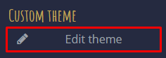
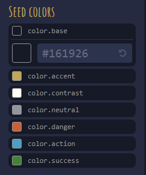
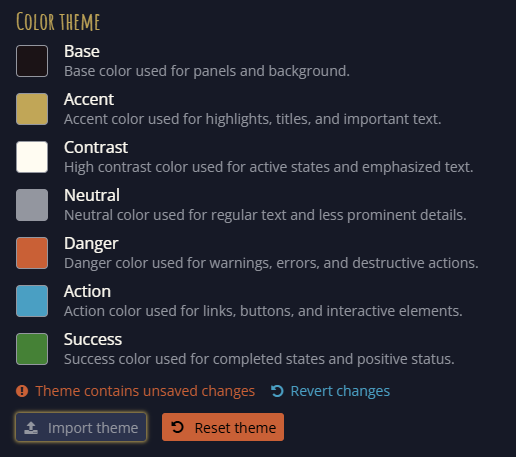
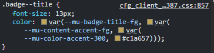
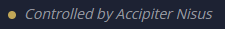
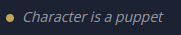

The previous release let realm owners set a colour theme from six seed colours. Since then, Mucklet has gained semantic colour tokens that make the interface more consistent, accessible, and customisable.

Now custom themes are available to everyone.

## Features

### Custom themes

Open **Player Settings** from the cog menu near logout, then select **Edit theme**.

The custom-theme view lists every available colour token. Select a token to set its colour code, and use the preview to see the result before applying it.

### Saving, exporting, and importing themes

Use the buttons at the bottom of the editor to save a theme locally, export it to a file, or import a previously exported file. Exporting makes it easy to share a theme or move it between browsers and devices.

### Realm themes

Realm owners can apply an exported custom theme as their realm’s default theme:

1. Open **Mucklet Account – Realms**.
2. In the **Colour theme** section, choose **Import theme**.
3. Select the exported JSON theme file and save the realm settings.

Resetting a realm theme restores the normal seed-colour theme. Realm themes are imported rather than edited directly in the account page, so create and test the theme first in the custom-theme editor.

### Theme token inheritance

Mucklet has 243 colour tokens, based on seven seed colours. Tokens inherit colour values through a small hierarchy, so changing one seed can update related interface elements while still allowing precise overrides.

| Token | Inherits from |
| --- | --- |
| `color.accent` | The accent seed colour |
| `color.accent.300` | An accent colour variant |
| `content.accent.fg` | Accent content |
| `badge.title.fg` | Badge-title text |

In the editor, token names omit the `--mu-` prefix and replace hyphens with dots. For example, `--mu-content-accent-fg` appears as `content.accent.fg`.

## Improvements

### UI changes

Unread mail now has a coloured indicator. The same status colour is also used for unassigned reports, help requests, and ownership requests.

Puppeted characters now display an indicator in character-related views, including Character Select, Awake, and Room Info.

The **Looking for Roleplay** control has also been refined.

Scrollbar thumbs now use the relevant semantic theme tokens: `scrollbar.thumb.bg` and `simplebar.thumb.bg`.

### Improved access-token refresh

Access-token refresh behaviour has been improved, resolving a problem that could interrupt a session when a token expired.

### PKCE for OAuth 2.0

OAuth 2.0 authentication now uses PKCE, improving the security of the authorisation flow.

## Fixes

### IPv6 connections translated to an internal IPv4 address

IPv6 connections were previously translated to the same internal IPv4 address. This has been corrected, and the affected stored data has been cleared.

### About Character avatars appeared clickable

Avatars shown in **About Character** no longer show a pointer cursor when they are not interactive.

### Navigation exit lists could render incorrectly

When a room had no area map, its navigation exit list could be cropped. Thanks to Kredden, Vernon, and GreenReaper for reporting the issue.

### Switching character while editing an exit lost keyword changes

Unsaved exit-keyword changes are now retained correctly when switching character.

### Room Info tools did not appear after an ownership change

Room Info tools now appear correctly after ownership changes.
