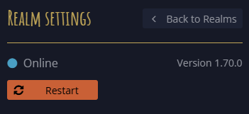

With a lot of work done on the multi-realm features, we finally have something that we feel we can show you. This release may not add any features to the game itself. But we are still happy with how it turned out.

So, let us present to you the new Mucklet start page!

## Features

### Mucklet start page



Is it a feature? It is more like a new "app", acting as a hub for all the realms hosted by Mucklet.

Can you create your own realms yet? No.  
Can you see existing realms? Yes.  
Can you search the realm list? Yes.  
Can you read info about Mucklet? Also yes.





## Improvements

### Realm restart


The _Realm settings_ page for realm owners now has a _Restart_ button:

In case the realm acts up, owners may restart the realm without having to contact us.

### Character count

Each realm now streams updates on _character count_.  
This allows the Mucklet start page to display the current number of awake characters, as well as the total number of characters created, as a measure of realm size:

## Fixes

### Destination room not found when creating exit to new room

The _Create new exit_ dialog, when the _Create new room_ checkbox was checked, could sometimes show the error message:

> Destination room not found.

This has been fixed, and the search has been improved to allow searches for any character.





### Script error: exceeded number of allowed iterators

The iterator counter for scripts didn't reset correctly, eventually causing an error in the script logs:

> exceeded number of allowed iterators

This has been fixed.
