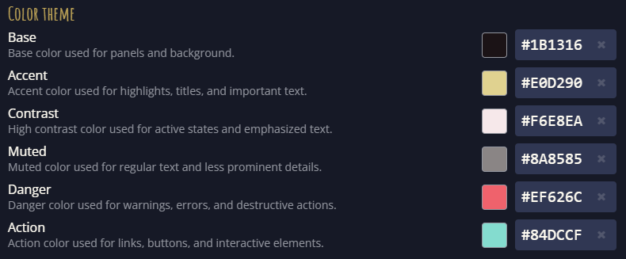

This release may not contain many features, but the feature it does contain required quite a bit of tinkering to get right.

To make different realms feel more, eh, different, we present to you: _Realm theme colors_!

(They can also be used to improve accessibility by providing higher contrast.)

## Features

### Realm color themes

Under [Mucklet - Account - Realms](https://mucklet.com/account/#realms), realm owners can now set the client’s color theme:

It is also possible to create links that override the realm’s default styling, such as:

- [Mucklet Test - Cocoa brown](https://test.mucklet.com/?theme.color.base=%2322181c&theme.color.accent=%23e0d290&theme.color.contrast=%23f6e8ea&theme.color.muted=%238a8585&theme.color.danger=%23ef626c&theme.color.action=%2384dccf)
- [Mucklet Test - Michelangelo](https://test.mucklet.com/?theme.color.base=%2308120b&theme.color.muted=%23dfb9b3&theme.color.danger=%23ff3864&theme.color.action=%2331e981&theme.color.accent=%23ff9f64)
- [Mucklet Test - Higher contrast](https://test.mucklet.com/?theme.color.contrast=%23ffffff&theme.color.muted=%23c9cacf&theme.color.accent=%23e5d08e&theme.color.base=%230f111a)

> [!NOTE]
>
> The first version of themes supports setting six basic colors, from which all other colors are currently derived.
>
> In later releases, more granular options will be added, including the selection of fonts and other styles.
