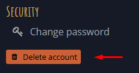
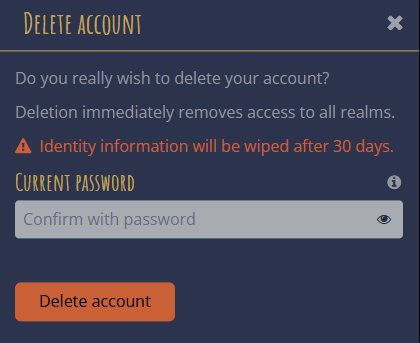
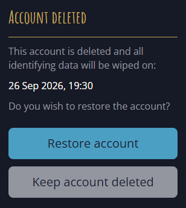

A feature long missing is finally added.
Hopefully none of you will have a need for it. But if you ever do need it, for whatever reason, it should be there. And now it is!

We also have a this new page for documentation. And a client version management system that is implemented for multi-realm functionality.

## Features

### Account deletions

On the [Mucklet Account - Overview](https://mucklet.com/account/#overview) page, there is now a _Delete account_ button under the _Security_ section:

Clicking it will open a dialog where you confirm with your password (or a Google confirm link):

Access to all realms will be withdrawn as soon as the account is deleted, and all identifying data will be scheduled to be wiped after 30 days.

If you try to log in during the 30 day period, you will be given the option to restore the account, or keep it deleted:

Once the deadline is passed, all identifying data will be wiped.

### Mucklet Docs

The site you are currently at was created as part of this release.

It is a place for documentation related to Mucklet, such as releases, guides, API references, and scripting resources. Initially it only hosts info on releases.

Welcome here!

## Improvements

### Scss class cleanup
Many scss files defined classes that were not used in the components. All those classes has now been removed.

## Fixes

### Failed clearCacheAndReload causes error

If an error occurred during a client update (clear cache and reload), the error was not properly handled. This has been fixed.
[GitHub issue #514 - Failed clearCacheAndReload causews error](https://github.com/mucklet/mucklet-client/issues/514)

### Google account select not showing
After logging out from an account connected to Google, and then trying to Sign in with Google again, you were not presented with a Google account select screen. Instead you were directly redirected back to Mucklet, logged in. This has been fixed, and a Google account selection screen is now showing.

Instead, we always want a user to be able to select Google account after clicking Sign in with Google.